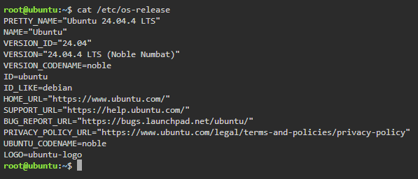
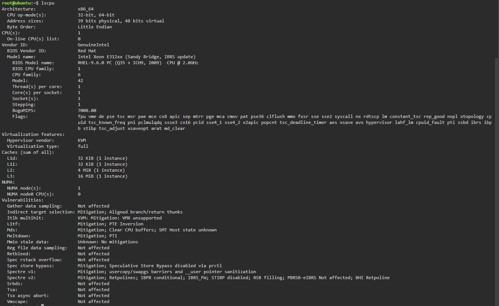
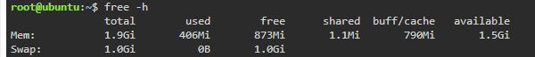
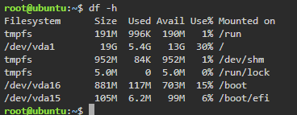

# Linux Investigation Using KillerCoda

A Linux environment was examined using KillerCoda to identify the server's operating system, processor, memory, and disk capacity. Basic Linux commands were used to collect the required system information.

---

## 1. Operating System

The Linux distribution and version were identified using the following command:

```bash
cat /etc/os-release
```

This command displays important details about the operating system installed in the KillerCoda environment.

### Terminal Evidence 1 – Operating System

[KillerCoda Terminal 1 - Operating System](screenshots/killercoda-terminal1.png)

[](screenshots/killercoda-terminal1.png)

---

## 2. CPU Information

The processor details of the Linux environment were checked using:

```bash
lscpu
```

This command provides information about the CPU architecture, processor count, cores, threads, and other processor specifications.

### Terminal Evidence 2 – CPU Information

[KillerCoda Terminal 2 - CPU Information](screenshots/killercoda-terminal2.png)

[](screenshots/killercoda-terminal2.png)

---

## 3. Memory

The available memory was examined using:

```bash
free -h
```

This command presents the system's memory information in a human-readable format, including total, used, free, and available memory.

### Terminal Evidence 3 – Memory

[KillerCoda Terminal 3 - Memory](screenshots/killercoda-terminal3.png)

[](screenshots/killercoda-terminal3.png)

---

## 4. Disk Space

The server's disk usage was checked using:

```bash
df -h
```

This command shows the total storage capacity, used space, available space, and usage percentage of mounted filesystems.

### Terminal Evidence 4 – Disk Space

[KillerCoda Terminal 4 - Disk Space](screenshots/killercoda-terminal4.png)

[](screenshots/killercoda-terminal4.png)

---

## Linux System Information Summary

| **System Information** | **Command Used**      | **Evidence**        |
| ---------------------- | --------------------- | ------------------- |
| Operating System       | `cat /etc/os-release` | Terminal Evidence 1 |
| CPU Information        | `lscpu`               | Terminal Evidence 2 |
| Memory                 | `free -h`             | Terminal Evidence 3 |
| Disk Space             | `df -h`               | Terminal Evidence 4 |

---

## Cloud Migration

If the Linux server were migrated to the cloud, it could be hosted by any of the three major cloud providers using their virtual machine services.

| **Cloud Provider**          | **Service That Could Host the Linux Server** |
| --------------------------- | -------------------------------------------- |
| AWS                         | Amazon EC2                                   |
| Microsoft Azure             | Azure Virtual Machines                       |
| Google Cloud Platform (GCP) | Compute Engine                               |


