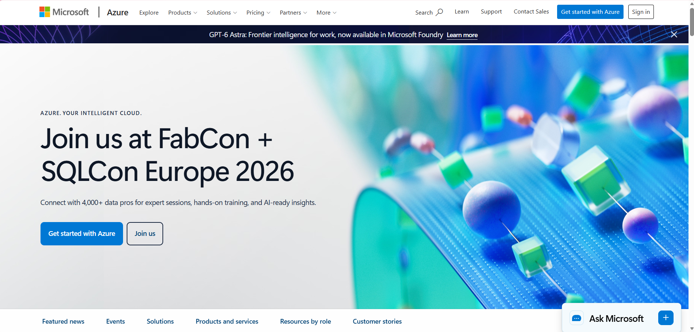

# Microsoft Azure Research

## Brief Overview

Microsoft Azure is Microsoft's public cloud computing platform. Azure provides cloud services for computing, storage, networking, databases, security, artificial intelligence, analytics, and application development.

Azure is especially useful for organizations that already use Microsoft technologies such as Windows Server, Microsoft 365, and Active Directory.

## Global Infrastructure

Microsoft Azure operates a global infrastructure consisting of geographic regions and availability features.

Azure regions are located in different parts of the world and allow organizations to select locations based on requirements such as latency, compliance, and availability.

Azure also provides networking capabilities that allow resources to communicate across regions and with on-premises environments.

## Cloud Management Console

The Azure Portal is a web-based management interface used to create, configure, monitor, and manage Azure resources.

Users can deploy virtual machines, configure virtual networks, manage storage, manage identities, monitor applications, and control cloud resources through the portal.

## Four Core Services

### 1. Azure Virtual Machines

Azure Virtual Machines provide scalable computing resources.

They can run both Windows and Linux operating systems and can be used to host applications and workloads.

### 2. Azure Blob Storage

Azure Blob Storage is an object storage service designed for storing large amounts of unstructured data.

It can store documents, images, videos, backups, logs, and application data.

### 3. Azure Virtual Network

Azure Virtual Network provides private networking capabilities for Azure resources.

It supports subnets, routing, network security, and connections to on-premises networks.

### 4. Microsoft Entra ID

Microsoft Entra ID is Microsoft's cloud-based identity and access management service.

It provides authentication, authorization, identity management, and access control.

## Three Advantages

### 1. Microsoft Integration

Azure integrates closely with Microsoft technologies such as Windows Server, Microsoft 365, Active Directory, and Microsoft Entra ID.

### 2. Hybrid Cloud

Azure provides services that allow organizations to connect on-premises infrastructure with cloud resources.

### 3. Enterprise Support

Azure provides a broad range of services designed for enterprise applications, security, databases, analytics, and infrastructure.

## Typical Enterprise Use Cases

Azure is commonly used for:

- Windows Server migration
- Hybrid cloud environments
- Microsoft enterprise applications
- Microsoft 365 integration
- Database applications
- Web applications
- Artificial intelligence
- Data analytics
- Enterprise identity management
- Virtual desktop infrastructure

## Screenshot Evidence

